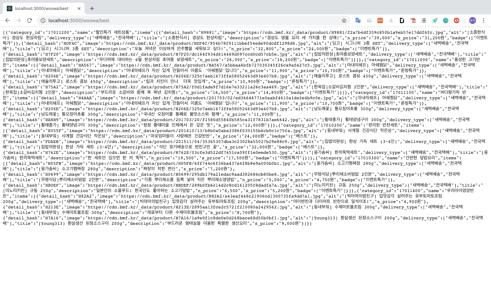

## 8. api 만들기

#### 기능설명

- nodejs기반 웹어플리케이션 express를 사용하여 api제작

#### 배우게 된 것

- express사용법 ( Getting Started )

- express의 다양한 메서드

- app.js에서 모든걸 처리하지 않고 파일별로 모듈화를 해서 처리하면 좋다.

- 간략한 백엔드에서의 처리과정을 배웠고, 

  웹개발에서 백엔드와 프론트엔드가 어떻게 상호작용을 하는지 직접해보니 잘 알게된 거 같다.

