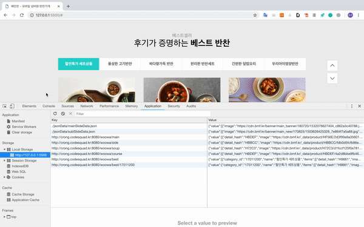

## 7.캐시기능( localStorage )



#### 기능설명

api요청을 할 때  똑같은 api를 또 요청한다면 그 것을 localStorage에 저장 후 재사용한다.


구현전에는 ajax를 만들어서 사용하거나, fetch를 사용해서 이벤트동작마다 api요청을 했었다.

```js
function ajax({ url, handler, requestType }) {
    const xhr = new XMLHttpRequest();
    xhr.addEventListener('load', () => {

        const requestData = JSON.parse(xhr.response);
        handler(requestData);
    })
    xhr.open(requestType, url);
    xhr.send();
}
```

```js
function inputEventHandler({target}){
    showElement(this._el.searchList)
    fetch(this.getRequestUrl(target.value), { mode : 'cors'})
        .then(reponse => reponse.text())
        .then(text=>{this.render(JSON.parse(text))})
        .catch(error=>{})
}
```


캐시기능을 구현하기 위해서 checkLocalItem함수를 만들었다.

```js
function request(url, requestType = "GET") {
    return new Promise((resolve, reject) => {
        const xhr = new XMLHttpRequest();
        xhr.addEventListener('load', () => {
            const res = JSON.parse(xhr.response)
            res.error || xhr.status !== 200 ? reject('error') : resolve(res);
        })
        xhr.open(requestType, url);
        xhr.send();
    })
}

export async function checkLocalItem(url) {
    try {
        if (localStorage.getItem(url)) return;
        const value = await request(url);
        setLocalItem(url, value);
    } catch (e) {
        return true;
    }
}
```

기능은 이렇다.

localStorage에 데이터가 있으면 그대로 return을 하고, 

없다면 API요청해서 localStorage에 저장을 해준다.


#### 배우게 된 점

- promise, async & await에 대해서 제대로 알게 되었다.

- api요청하기위해서 ajax라는 함수도 만들어보고, promise를 써서 만들기도 해보고, async를 사용하기도 해봤다.

  다양하게 시도하고 삽질해서 사용하기만 하지않고 특징을 잘 알게 되었다.

- 코드도 더 간결하게 구현하게 되고, 성능도 생각하게 되었다. 개인적으로 마음에 들게 구현했고, 자신감을 얻었다.