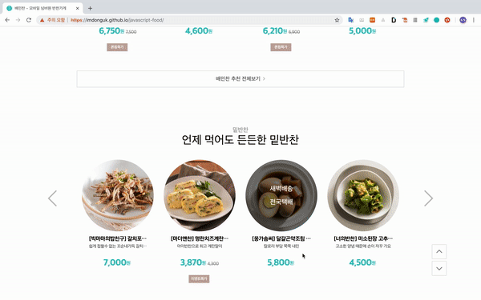

## 5. 페이지 상하단이동 버튼

#### 기능설명

- up버튼을 클릭시에 페이지최상단으로 이동하고 down버튼 클릭시에 페이지최하단으로 이동한다.
- 스크롤시에는 버튼이 안보이게 된다.

browser API를 사용해 현재 스크롤한 위치와 총 브라우저의 높이 값을 알 수 있었다.

#### 버튼클릭시

requestAnimationFrame이란 메서드를 사용해서 일정조건을 만족 시킬 때까지 높이값을 증가시키거나 감소시켰다.

#### Debouncing & Throttling

이 때 debounce와 throttle이라는 기능을 알 게 되었다. 이 두가지 기능은 성능에 관한 기능이다.

- 첫번째로 trottle이라는 기능에 대해서 설명하겠다.

  한번 이벤트를 주어서 동작이 일어날 때 일정시간동안은 이벤트를 발생시켜도 동작을 하지 않는 기능이다.

  슬라이드를 예로 들자면 다음컨텐츠를 보기위해서 버튼을 클릭했을 때 애니메이션 시간이 1초라고 한다면

  1초동안은 이벤트를 발생시켜도 동작이 일어나지 않는다.

- 두번째로 debounce라는 기능이다.

  이벤트를 주어서 동작이 일어날 때 일정시간안에 이벤트가 동작하지 않을 시에 동작이 일어난다.

  input이벤트를 예로 들면 '우기'라는 검색을 할 때 'ㅇ','ㅜ','ㄱ','ㅣ' 4번의 이벤트가 발생했고, 4번의 동작이 일어난다.

  그런데 나는 '우기'라는 검색을 하고 싶고 1번의 동작만 하고싶다.

  debounce는 처음에 'ㅇ'라는 이벤트가 발생하고 1초후에 동작이 발생된다.

  하지만 1초안에 'ㅜ'라는 이벤트가 또 발생한다면 그 시점부터 1초후에 동작이 일어난다.

  이벤트가 발생할 때 마다 리셋이 되는 것이다.

  결과적으로 '우기'라는 검색어를 모두 입력하고 1초후에 동작이 일어난다. 

#### 스크롤할 시에

scroll이벤트발생시엔 페이지상하단이동버튼이 보이지 않게 된다. 그런데 갑자기 딱 보였다가 또 안보이면 뭔가 딱딱하다.

1. opacity 애니메이션 효과

   바로 사라졌다보였다 하는 것보다 CSS애니메이션효과를 주었다.

2. debounce

   debounce를 사용하여 200ms동안 스크롤하지않을 시에만 버튼이 보이도록 하였다. 

   보통 사용자는 스크롤을 하면서 페이지상하단 버튼을 클릭하지 않기 때문이다. 

   그래서 스크롤할 때는 보이지 않고 일정시간 스크롤하지 않을 시에만 보여지도록했다.

