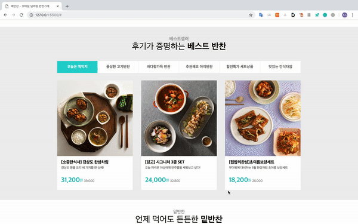

## 2. TabUI

#### 기능설명

탭을 클릭하면 탭의 주제에 맞는 UI가 화면에 노출된다.

#### 동작설명

1. 탭을 클릭한다.
2. ajax요청을 해서 해당 태그에 맞는 API를 가져온다.
   - 해당 엘리먼트 태그에 고유한 속성인 category_no가 있다. 
   - URL과 category_no를 결합하여 그 URL에 데이터요청을 한다.
3. 가져온 API를 template를 통해서 문자열 html코드로 변경시켜준다.
4. 화면에 렌더링해준다.

#### 배우게 된점

1. xmlhttprequest을 통해 api요청하는 방법
2. 요청한 api를 template을 통해서 화면에 렌더링 시키는 경험

