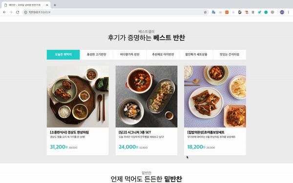
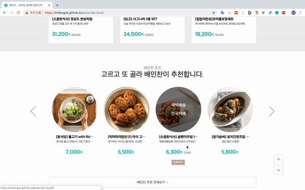
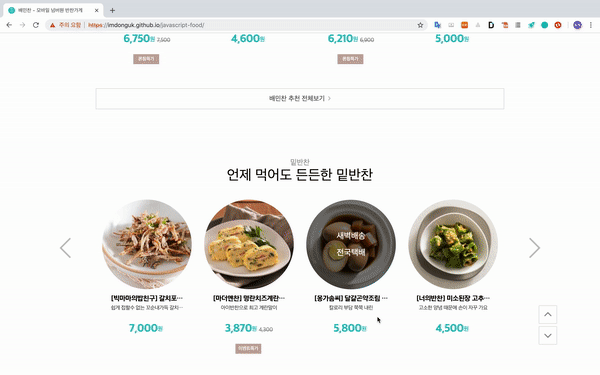
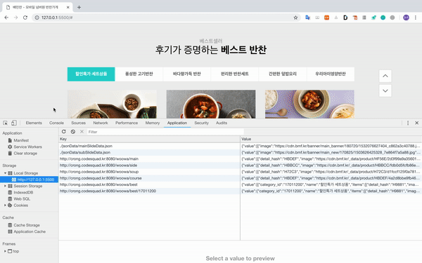
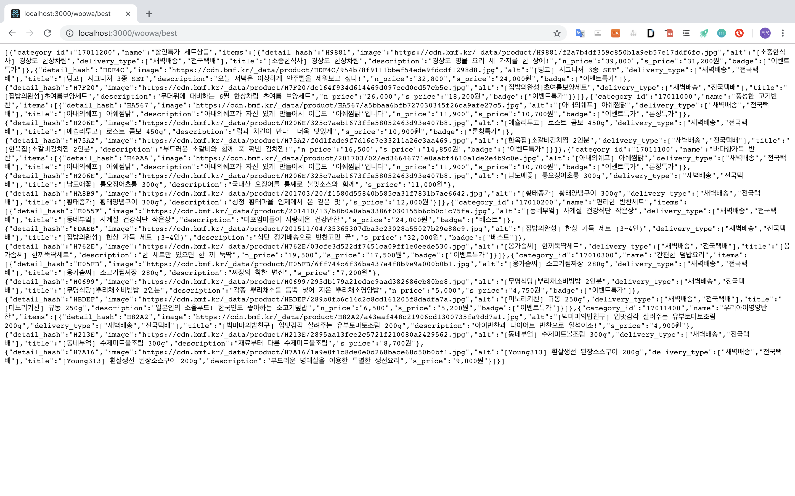

# Component기반 Web UI구현

> [ProjectDemo](https://imdonguk.github.io/javascript-food/)

## introdution

* 실제 [배민찬](https://www.baeminchan.com/) 사이트를 직접 구현

* HTML, CSS, javascript(ES6)만을 사용

* slide, tabUI, 페이지 상하단 이동버튼, 검색자동완성, 최근검색어 기능을 가진 web UI

### 주요특징

* Component별 모듈분리
* 같은 기능을 가진 UI 재사용, 같은 template 재사용
* API에 맞는 Template사용
* 프레임워크나 라이브러리 의존없이 vanillajs만을 사용
* node기반 웹프레임워크 Express를 사용하여 API제작
* 일관성을 유지한 코드
* ES6문법 적극사용( promise, fetch, async & await )
* 코드품질을 높이기 위한 리팩토링과정을 반복
* 성능을 고려한 기능 ( localStorage를 사용한 Cache, throttling, debounce )

## 설계

### 설계 전 고민

그 전의 프로젝트에서 MVC라는 패턴을 적용한 경험이 있어서 그런지 MVC패턴이 뭔가 막강해보였다. 그런데 이번 프로젝트의 특징이 UI간의 영향을 서로 주지않았다. 그 때  'component단위로 클래스를 만들고 기능을 어떻게 구현할 지 고민을 하면 되겠다'라는 생각이 들었다. '다양한 이벤트를 어떻게 적용하고 어떻게 기능을 구현할 지에 대해서 고민하면 되겠다.'라고 생각했다.

* 역할에 맞게 클래스를 나눈다.
* 한번에 전체를 생각하지 말고, 기능별로 작게 나누어서 생각한다.
* 그 해당기능의 흐름을 이해한다.
* 기능에 필요한 동작들의 함수를 설계한다. 빈함수에 어떤동작인지의 이름만 정의해준다.
* 기능의 하위기능이 있어서 클래스를 나눌 수 있다면 나눈다.

## 프로젝트 제작과정

<b>자세한 설명은 링크를 통해서 보실 수 있습니다.</b>

1. <b>[html, css 구조설계 및 스타일적용](./project_functional_review/project_html_css.md)</b>

.png)

2. <b>[tabUI](./project_functional_review/project_tabUI.md)</b>

3. <b>[slide](./project_functional_review/project_slide.md)</b>

   

4. <b>[menuSlide](./project_functional_review/project_menuSlide.md)</b>

5. <b>[페이지 상하단 이동버튼](./project_functional_review/project_scroll.md)</b>

6. <b>[검색자동완성](./project_functional_review/autoComplete.md)</b>

7. <b>[캐시기능](./project_functional_review/project_cache.md)</b>

8. <b>[검색자동완성 API 만들기](./project_functional_review/project_api.md)</b>

## 프로젝트를 구현한 후에 

* 다양한 UI제작경험

  TabUI, Slide, 자동완성기능, 애니메이션효과, API제작 등 다양한 경험을 하니깐 알 게 된 것도 많았다.

  API요청을 할 때도 ajax함수를 직접 만들어보며 장단점을 파악하고, promise를 사용해서 만들어보기도 했다.

  fetch를 사용해서 간단하게 API요청도 했고, 비동기코드를 동기적로직처럼 보이게 Promise, async & await를 사용했다.

  CSS도 pixel, vmax, vmin, rem, em등 크기를 결정하는 단위를 다양하게 써보면서 장단점을 체감하게 됐다. 

  > 매우 개인적으로 프로그래밍을 하면서 머리속에 가지고 있는게 아니라 
  >
  > 최대한 행동으로 시도하고 많은 경험을 통해 습득을 해야 얻는 게 많다고 생각이 된다.

* 디버깅 숙련도

  * 크롬 개발자도구의 Sources탭뿐만아니라 UI를 만들면서 Elements탭 API요청을 하면서 Network탭 localStorage를 사용하면서 application탭까지 사용함에 있어서 숙련이 되었다.

  * Sources탭에서 breackPoints를 설정하고 해당 CallStack, Scope를 확인하고, 이 때 console탭으로 확인하며 버그가 생겼을 시에 빠른속도로 정확하게 원인을 파악하고 해결을 할 수 있게 되었다.

* 설계방식

  ~~~js
  mouseoverEventHandler(){
  
  }
  
  mouseleaveEventHandler(){
  
  }
  
  keyupArrowUpHandler(){
  
  }
  
  keyupArrowDownHandler(){
  
  }
  
  keyupEnterHandler(){
  
  }
  ~~~

  이런식으로 클래스내에서 메서드를 이름을 통해서 동작을 알려주는 빈함수를 만들었다. 

  이렇게 설계를 하니깐 머리속으로만 생각했던게 한눈으로 보이니 너무 좋았고, 

  클래스 내에서 무슨동작이 있는지 한눈에 명확히 알 수 있어서 좋았다. 

  또 메서드를 세분화해서 분리하니깐 '이 메서드는 이 동작이 있는 코드만 짜면 되겠다.'라는 생각이 들었다.

* 가독성 좋은 코드

  ~~~js
  mouseoverEventHandler({ target }) {
      if (target.tagName !== 'LI') return;
      this.removeSelectedClassName();
      this.addSelectedClassName(target);
  }
  
  mouseleaveEventHandler() {
      this.removeSelectedClassName();
      this.resetSelectedElement();
  }
  
  keyupHandler({ key }) {
      if (key === "ArrowUp" || key === "ArrowDown") this.arrowkeyHandler(key)
      if (key === "Enter") this.enterkeyHandler()
  }
  ~~~

  이 코드를 예로 들자면 가독성 좋은 코드를 하기 위해서 최대한 메서드명을 통해서 동작을 설명하고자 했다.

  mouseoverEventHandler메서드는 mouseover이벤트 발생시의 동작이고 그 안에서 

  removeSelectedClassName메서드를 호출하는데 전에 선택된 타켓의 클래스네임을 제거해주고,

  addSelectedClassName메서드를 호출해서 새롭게 선택된 타켓에 클래스네임을 추가해준다.

  이런식으로 최대한 이름을 통해서 무슨동작을 하는지 알 수 있게 구현을 하였다.

* 효율성 좋은 코드

  * 간단한 if문은 삼항연산자를 사용하고
  * &&문을 사용해 false일 때는 뒤의 동작이 일어나지 않게 하며
  * pipe함수를 만들어서 연속적으로 함수의 반환값을 받아야될 시에 효율적으로 해결하였다.

​	

​	

​	